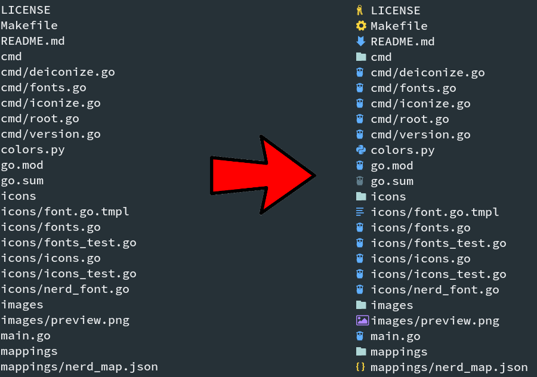

# izer

izer is a command-line tool for adding icons to filenames.

izer is heavily inspired by [VimDevIcons](https://github.com/ryanoasis/vim-devicons).



## Pros

- Portable, no dependencies
- Fast
- Icon sets for different fonts
- Colored icons
- Deiconize feature for removing icons from filenames
- Smooth integration with [fzf](https://github.com/junegunn/fzf)

## Benchmark

```shell
BenchmarkDeiconize-8                          10        1118691512 ns/op
--- BENCH: BenchmarkDeiconize-8
    deiconize_bench_test.go:28: Input size: 44148 KB - 1356000 lines
BenchmarkIconize/Nerd-8                       10        1301644333 ns/op
BenchmarkIconize/NerdColor-8                  10        1567274214 ns/op
BenchmarkIconize/NerdDir-8                    10        1829822057 ns/op
BenchmarkIconize/NerdDirColor-8               10        2202257278 ns/op
--- BENCH: BenchmarkIconize
    iconize_bench_test.go:32: Input size: 19472 KB - 1356000 lines
```

## Installation

### From binaries

The [release page](https://github.com/NightWolf007/izer/releases) includes
precompiled binaries for Linux, FreeBSD, macOS and Windows.

### Using Go

```shell
go get -u github.com/NightWolf007/izer
```

## Usage

### Iconize

`iconize` command adds icons to filenames.
You can pass filenames to command through stdin or as arguments.

#### Command-line options

```shell
Usage:
  izer iconize [flags]

Flags:
  -c, --color         Enable colorful output
  -d, --dir           Enable icons for directories (Slows down the process due checking files)
  -f, --font string   Font to be used. See: izer fonts
  -h, --help          help for iconize
```

#### Simple usage

```shell
# Using arguments
izer iconize -f=nerd somefile.go somefile2.py

# Using stdin
find . | izer iconize -f=nerd
```

#### Directory icons

Checking that filename is directory or not slows down the iconization process.
Thus, by default izer handles directories as a simple files.

To enable directory icons use `-d` opton.

```shell
# Using arguments
izer iconize -f=nerd -d somedir somefile.go

# Using stdin
find . | izer iconize -f=nerd -d
```

#### Colored icons

`-c` option prints icons in ANSI colors

```shell
# Using arguments
izer iconize -f=nerd -c somefile.go somefile2.py

# Using stdin
find . | izer iconize -f=nerd -c
```

### Deiconize

`deiconize` command removes icons from filenames (undoing iconize command).
You can pass filenames to command through stdin or as arguments.

```shell
# Using arguments
izer deiconize " somefile.go" " somefile.py"

# Using stdin
find . | izer iconize -f=nerd | izer deiconize
```

### Supported fonts

To show list of all supported fonts use `fonts` command.

```shell
izer fonts
```

### Using izer with [fzf](https://github.com/junegunn/fzf)

You can use izer to iconize files in fzf.

```shell
# Set default preview command
export FZF_DEFAULT_PREVIEW="fd --type file | izer iconize -f=nerd -c"

# Run fzf
fzf | izer deiconize

# Run fzf with preview
fzf --preview 'bat $(izer deiconize {})' | izer deiconize
```

More info about fzf usage [here](https://github.com/junegunn/fzf#usage).

## Development

### Prerequisites

- Go 1.13
- [gomplate](https://github.com/hairyhenderson/gomplate)
- [golangci-lint](https://github.com/golangci/golangci-lint)

### Building

```shell
# Build izer binary
make

# Generate font files and test inputs from mappings
make generate
```

### Linting

```shell
# Using make
make lint

# Alternatively, you can run golangci-lint directly
golangci-lint run
```

### Testing

```shell
# Run all tests
make test

# Run integration tests
make itest

# Update test golden files
make goldens
```

### Benchmarking

```shell
# Run integration benchmarks
make bench

# Also, you can pass benchtime through variable
BENCHTIME=10x make bench
```
